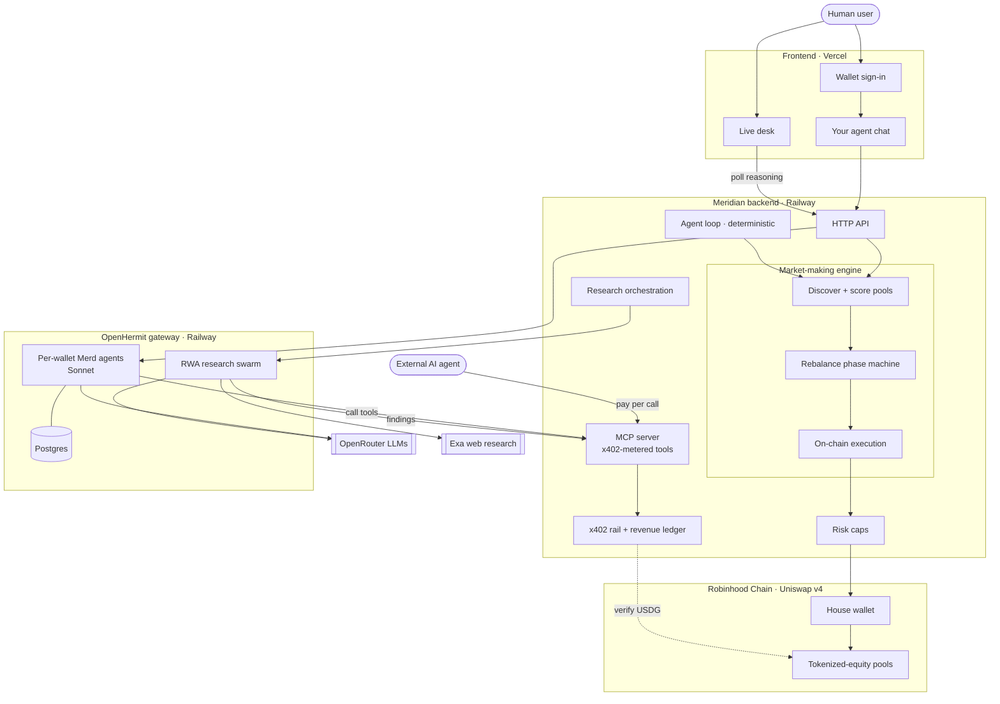

<p align="center">
  
</p>

**Autonomous AI market-making for tokenized equities on Robinhood Chain.**

Meridian is a platform for the agentic economy. An autonomous agent named Merd
makes markets in tokenized stocks (AAPL, NVDA, TSLA, GOOGL, META and more) on
Robinhood Chain, entirely on-chain and fully transparent. Sign in with a wallet
and you get your own Merd to talk to and put to work: it quantifies real,
self-custodied ways to earn and you sign each one yourself. Agents pay per call,
from their own wallets, for the same market data and execution tools Merd runs
on, metered over [x402](https://www.x402.org).

**Live:** [meridian402.xyz](https://meridian402.xyz) · Watch the agent work in
real time and read its on-chain [track record](https://meridian402.xyz/track-record).

## What it does

- **Makes markets autonomously.** Merd provides concentrated liquidity in
  tokenized-equity pools on Robinhood Chain's Uniswap v4, discovers which pools
  are worth being in, re-centers and rebalances as price moves, and enforces its
  own risk caps in code. Every position and every swap is on-chain and public.
- **Gives every user their own agent.** Connect a wallet (sign a message, no
  account, no keys) and Meridian provisions a personal Merd instance you can
  chat with immediately. It reasons over the live market and tells you what it
  would do. It never touches your funds.
- **Lets you earn from day one, self-custodied.** Your agent quantifies real,
  on-chain earning paths and hands you the transaction to sign yourself: park
  idle USDG at a measured rate, hold a position that pays out in tokenized
  stocks from real trading fees, or send your agent scouting the RWA market for
  USDG bounties on genuinely new venues it surfaces. You sign every transaction;
  Meridian builds the calldata but holds no key and can move nothing.
- **Sells its edge to other agents.** The signals and execution paths Merd
  trades on are exposed as tools any agent can call and pay for per use over
  x402: market data, LP scoring, carry quotes, the RWA universe map, and atomic
  execution. No subscriptions, no API keys.
- **Shows its work.** A live desk streams Merd's reasoning as it happens, and a
  track record marks the book to market with real transaction hashes.

## Architecture

Two things flow through Meridian: **users**, who sign in and talk to their own
agent or watch the live desk, and **other agents**, who pay per call over x402
for the tools Merd runs on. The backend is the hub. It provisions the LLM
agents on OpenHermit, runs the market-making engine, settles trades on Robinhood
Chain, and verifies payments on-chain.



Built as a layer on [OpenHermit](https://github.com/HCF-STUDIOS/openhermit):
OpenHermit is the agent runtime (durable state, sandboxed execution, fleet
management, scheduling). Meridian supplies the domain and does not run its own
agent loop. A "Meridian agent" is an OpenHermit agent with the Meridian tools
enabled.

This repository is the Meridian backend.

```
agent/    MCP tool server, the market-making engine, on-chain execution
          (Uniswap v4 on Robinhood Chain), the x402 payment rail, per-wallet
          agent provisioning, and the RWA research swarm.
```

The live desk and interface (Vite + React) is a separate app, deployed at
[meridian402.xyz](https://meridian402.xyz).

Key pieces in `agent/src`:

- `venues/` and `lp*.ts` — pool discovery, LP scoring, and the market-making
  engine (phase machine, cost-aware rebalancing, realized-net accounting).
- `deploy/myAgent.ts` — provisions and drives each user's personal Merd.
- `earn/` — the advise-then-approve earn surface: quotes and user-signed
  calldata for the carry and payout positions, plus scout-to-earn (agents hunt
  new RWA venues for capped USDG bounties). Builds transactions; holds no key.
- `payments/` — the x402 rail: an on-chain USDG facilitator with a replay
  ledger, and the paying side that settles tool calls hands-free.
- `research/` — a fleet that maps the on-chain RWA universe and feeds the
  agent's grounding.
- `risk.ts` — spend and size caps enforced server-side, so a prompt cannot
  exceed them.

## Status

Honest about where this is.

- **Live and real.** On-chain swaps and LP positions on Robinhood Chain's
  Uniswap v4, the x402 revenue rail, per-wallet agents, the three self-custodied
  earn paths (carry, the stock-payout position, scout-to-earn bounties), and the
  research swarm are all running against mainnet. The track record is real
  capital marked to market, not a backtest.
- **Small.** The house book runs at low size and is roughly break-even at
  current scale. Market-making margins are thin until volume and depth grow.
- **Coming next.** Today your agent quantifies each earning path and you sign
  it yourself. Letting the agent trade *your* funds on its own requires
  delegated, scoped signing (session keys); until that ships, it advises and
  approves, and never has custody of your wallet.

## Quickstart

```bash
cd agent
npm install
cp .env.example .env    # fill in the values you need
npm run dev             # MCP server on http://127.0.0.1:8787
```

See [agent/README.md](agent/README.md) for the tool catalog and
[agent/DEPLOY.md](agent/DEPLOY.md) for deployment.

## Stack

Robinhood Chain (chain id 4663), Uniswap v4, viem, x402 / MPP, the OpenHermit
SDK, TypeScript, React, and Vite.

---

Not financial advice. Tokenized assets are volatile and you can lose money.
